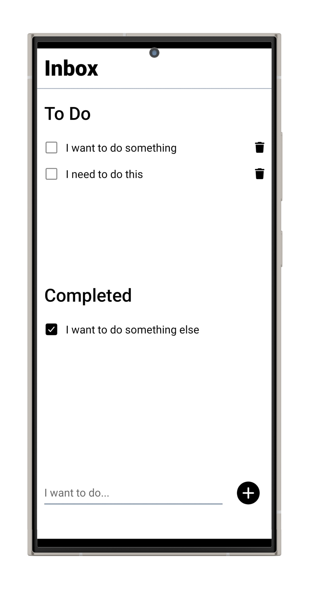

---

<p align="center">
    <h1 align="center">React Native To-Do App 📝</h1>
</p>
<p align="center">
  
</p>
<p align="center">
    <em><code>A simple and intuitive to-do list application built with React Native.</code></em>
</p>
<p align="center">
	
	
	
</p>
<p align="center">
		<em>Developed with the software and tools below.</em>
</p>
<p align="center">
	
	
	
	
</p>
<hr>

## Quick Links

> - [Overview](#-overview)
> - [Features](#-features)
> - [Repository Structure](#-repository-structure)
> - [Modules](#-modules)
> - [Getting Started](#-getting-started)
>   - [Installation](#-installation)
>   - [Running](#-running-)
> - [License](#-license)

---

## Overview

This React Native To-Do App is designed to help you keep track of your tasks and stay organized. It's built with React Native and features local persistent storage, allowing you to manage tasks efficiently.

---

## Features

- **Add Tasks:** Easily add new tasks to your to-do list.
- **Edit Tasks:** Modify existing tasks to keep them up-to-date.
- **Delete Tasks:** Remove tasks that are no longer needed.
- **Task Completion:** Mark tasks as complete to track your progress.
- **Persistent Storage:** Tasks are stored locally for persistence between app sessions.

---

## Repository Structure

```sh
└── /
    ├── App.js
    ├── LICENSE
    ├── app.json
    ├── assets
    │   ├── adaptive-icon.png
    │   ├── favicon.png
    │   ├── icon.png
    │   └── splash.png
    ├── babel.config.js
    ├── components
    │   ├── Checkbox.js
    │   ├── Completed.js
    │   ├── Form.js
    │   ├── Item.js
    │   └── ToDo.js
    ├── package-lock.json
    ├── package.json
    ├── tailwind.config.js
    └── utility
        └── storage.js
```

---

## Modules


<details closed><summary>utility</summary>

| File                                                                                           | Summary                         |
| ---                                                                                            | ---                             |
| [storage.js](https://github.com/Tudor230/react-native-todo-app/blob/master/utility/storage.js) | Handles persistent storage. |

</details>

<details closed><summary>components</summary>

| File                                                                                                  | Summary                         |
| ---                                                                                                   | ---                             |
| [Completed.js](https://github.com/Tudor230/react-native-todo-app/blob/master/components/Completed.js) | Component for displaying completed tasks. |
| [Checkbox.js](https://github.com/Tudor230/react-native-todo-app/blob/master/components/Checkbox.js)   | Checkbox component. |
| [ToDo.js](https://github.com/Tudor230/react-native-todo-app/blob/master/components/ToDo.js)           | Main to-do list component. |
| [Item.js](https://github.com/Tudor230/react-native-todo-app/blob/master/components/Item.js)           | Individual task item component. |
| [Form.js](https://github.com/Tudor230/react-native-todo-app/blob/master/components/Form.js)           | Form for adding and editing tasks. |

</details>

---

## Getting Started

### Installation

1. Clone the repository:

```sh
git clone https://github.com/Tudor230/react-native-todo-app/
```

2. Change to the project directory:

```sh
cd react-native-todo-app
```

3. Install the dependencies:

```sh
npm install
```

### Running

Use the following command to run:

```sh
npx expo start
```

---


## License

This project is licensed under the MIT License. See the [LICENSE](LICENSE) file for details.

---

[**Return**](#-quick-links)

---

